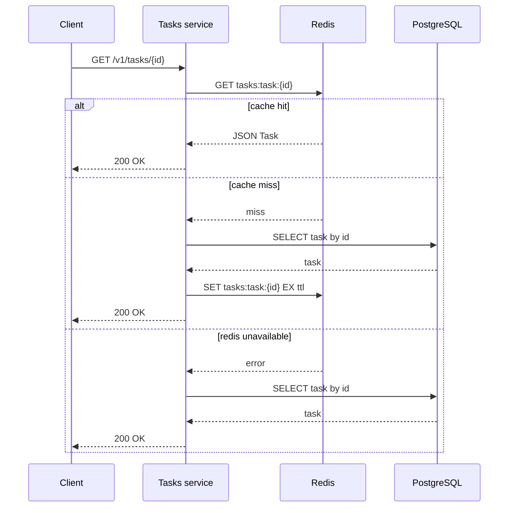
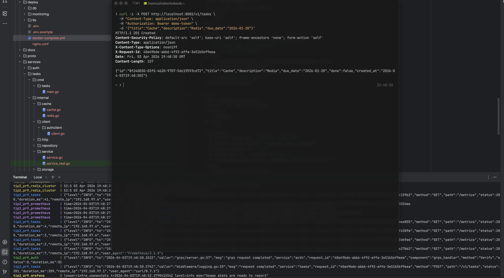
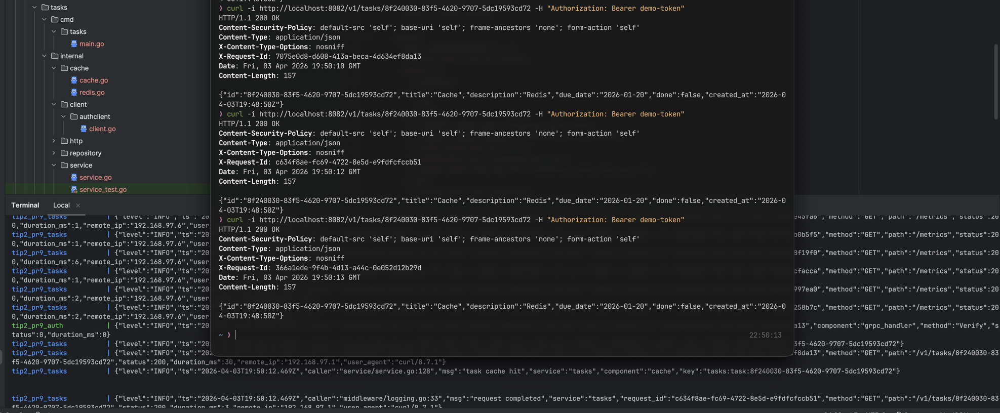
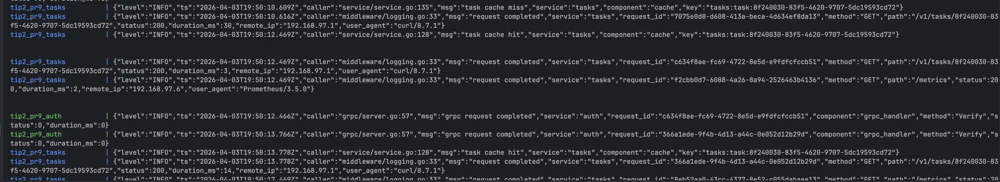
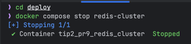
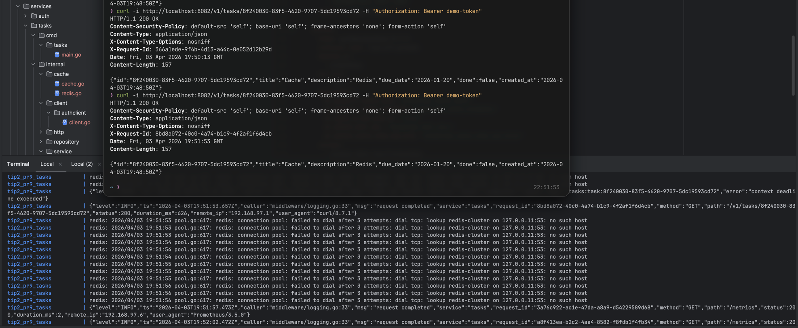
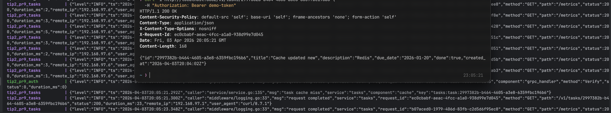
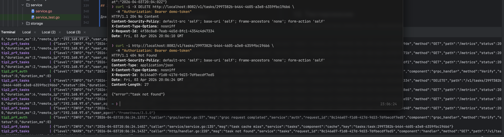
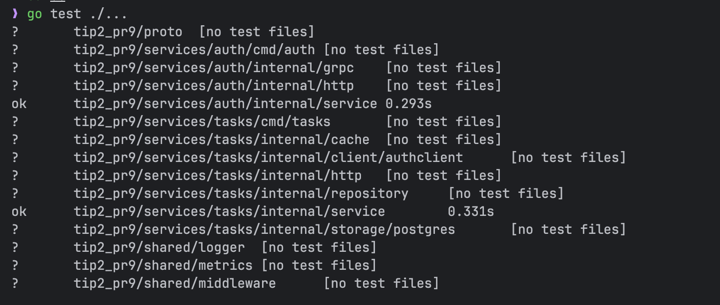

# Практическое занятие №9
## Рузин Иван Александрович ЭФМО-01-25
### Реализация распределённого кэша (Redis cluster)

---

## 1. Краткое описание

В рамках практической работы в сервис `tasks` был добавлен распределённый кэш на базе Redis.  
Кэширование реализовано по стратегии **cache-aside** для чтения задачи по идентификатору:

- сначала сервис пытается получить данные из Redis;
- если в кэше записи нет или Redis недоступен, чтение выполняется из PostgreSQL;
- после успешного чтения из БД объект сохраняется в Redis с TTL;
- при изменении или удалении задачи соответствующий кэш-ключ инвалидируется.

В качестве учебного стенда используется **Redis cluster** в Docker Compose.  
При отказе Redis сервис продолжает работать через БД, то есть кэш выступает только как ускоритель, но не как источник истины.

---

## 2. Что было реализовано

В проект были добавлены следующие возможности:

- подключение Redis в `tasks service`;
- отдельный слой кэша с интерфейсом `TaskCache`;
- реализация `RedisCache` и резервная `NoopCache`;
- cache-aside для `GET /v1/tasks/{id}`;
- TTL и jitter для записей в кэше;
- инвалидация кэша при `PATCH /v1/tasks/{id}` и `DELETE /v1/tasks/{id}`;
- деградация при недоступности Redis без отказа основного API;
- запуск Redis cluster через Docker Compose.

---

## 3. Используемые ключи кэша

Для кэширования задачи по идентификатору используется ключ следующего вида:

```text
tasks:task:<id>
````

Пример:

```text
tasks:task:7f0b2f0d-5d0a-4bc5-b6f8-8d7d6f23c111
```

Такой формат удобен тем, что:

* ключ однозначно соответствует одной задаче;
* легко выполнять инвалидацию;
* ключи читаемы и понятны при отладке.

---

## 4. Алгоритм cache-aside

Для метода `GET /v1/tasks/{id}` используется следующий порядок работы:

1. Формируется ключ кэша `tasks:task:<id>`.
2. Выполняется попытка чтения значения из Redis.
3. Если в Redis найдено значение:

    * JSON десериализуется в объект `Task`;
    * ответ возвращается клиенту.
4. Если значения в Redis нет:

    * сервис запрашивает задачу из PostgreSQL;
    * если задача найдена, она сериализуется в JSON;
    * результат сохраняется в Redis с TTL;
    * ответ возвращается клиенту.
5. Если Redis временно недоступен:

    * ошибка логируется;
    * чтение продолжается из PostgreSQL;
    * сервис не падает.

Схематично это выглядит так:



---

## 5. TTL и jitter

Для кэша были выбраны следующие параметры:

* `CACHE_TTL_SECONDS=120`
* `CACHE_TTL_JITTER_SECONDS=30`

Итоговый TTL вычисляется как:

```text
120 секунд + случайное значение от 0 до 30 секунд
```

### Зачем нужен TTL

TTL нужен для того, чтобы:

* кэш не хранил данные бесконечно;
* записи автоматически устаревали;
* данные периодически обновлялись из БД.

### Зачем нужен jitter

Если всем ключам задать одинаковое время жизни, они могут истечь одновременно.
Это может привести к резкому всплеску обращений в БД.

Jitter добавляет случайный разброс и снижает вероятность массового одновременного истечения ключей.

---

## 6. Инвалидация кэша

При изменении данных кэш должен сбрасываться, чтобы не возвращать устаревшую информацию.

В работе реализована следующая политика:

* после `PATCH /v1/tasks/{id}` удаляется ключ `tasks:task:<id>`;
* после `DELETE /v1/tasks/{id}` удаляется ключ `tasks:task:<id>`.

Если операция удаления ключа в Redis завершается ошибкой, эта ошибка только логируется.
Запрос при этом считается успешно выполненным, если изменение в БД прошло успешно.

---

## 7. Деградация при недоступности Redis

Redis является внешней инфраструктурной зависимостью, поэтому в работе предусмотрено корректное поведение при его отказе.

Реализованный подход:

* если Redis недоступен при старте, сервис переключается на `NoopCache`;
* если Redis недоступен во время чтения или записи, ошибка логируется как предупреждение;
* источник истины остаётся PostgreSQL;
* API продолжает работать через БД.

Таким образом, отказ кэша не приводит к недоступности сервиса `tasks`.

---

## 8. Переменные окружения

Для кэша используются следующие переменные:

```dotenv
REDIS_ADDRS=redis-cluster:7000,redis-cluster:7001,redis-cluster:7002,redis-cluster:7003,redis-cluster:7004,redis-cluster:7005
REDIS_PASSWORD=
REDIS_DB=0
CACHE_TTL_SECONDS=120
CACHE_TTL_JITTER_SECONDS=30
REDIS_OP_TIMEOUT_MS=300
REDIS_INIT_TIMEOUT_MS=1500
```

### Назначение параметров

* `REDIS_ADDRS` — список узлов Redis cluster;
* `REDIS_PASSWORD` — пароль Redis, если используется;
* `REDIS_DB` — номер БД для standalone-режима;
* `CACHE_TTL_SECONDS` — базовое время жизни кэш-записи;
* `CACHE_TTL_JITTER_SECONDS` — случайный разброс TTL;
* `REDIS_OP_TIMEOUT_MS` — таймаут операций чтения и записи;
* `REDIS_INIT_TIMEOUT_MS` — таймаут инициализации клиента Redis.

---

## 9. Запуск проекта

### 9.1. Подготовка

Из корня проекта выполнить:

```bash
go mod tidy
```

### 9.2. Запуск контейнеров

Перейти в директорию `deploy` и поднять стенд:

```bash
cd deploy
docker compose up -d --build
```

### 9.3. Проверка состояния контейнеров

```bash
docker compose ps
```

---

## 10. Проверка работы API и кэша

### 10.1. Создание задачи

```bash
curl -i -X POST http://localhost:8082/v1/tasks \
  -H "Content-Type: application/json" \
  -H "Authorization: Bearer demo-token" \
  -d '{"title":"Cache","description":"Redis","due_date":"2026-01-20"}'
```



Нужно сохранить `id` созданной задачи.

---

### 10.2. Первый и второй запрос чтения

```bash
curl -i http://localhost:8082/v1/tasks/<id> \
  -H "Authorization: Bearer demo-token"
```





Ожидаемое поведение:

* первый запрос даёт **cache miss** и обращается в БД;
* второй запрос даёт **cache hit** и читает данные из Redis.

---

### 10.3. Просмотр логов сервиса tasks

```bash
cd deploy
docker compose logs -f tasks
```

В логах можно увидеть сообщения вида:

* `task cache miss`
* `task cache hit`
* `redis get failed`
* `redis set failed`
* `redis delete after update failed`

---

### 10.4. Проверка деградации при отказе Redis

Остановить Redis cluster:

```bash
cd deploy
docker compose stop redis-cluster
```



После этого снова выполнить запрос:

```bash
curl -i http://localhost:8082/v1/tasks/<id> \
  -H "Authorization: Bearer demo-token"
```



Ожидаемый результат:

* сервис продолжает отвечать;
* данные возвращаются из PostgreSQL;
* в логах есть предупреждение о недоступности Redis.

---

## 11. Проверка инвалидации кэша

### Обновление задачи

```bash
curl -i -X PATCH http://localhost:8082/v1/tasks/<id> \
  -H "Content-Type: application/json" \
  -H "Authorization: Bearer demo-token" \
  -d '{"title":"Cache updated","done":true}'
```

После этого следующий запрос на чтение:

```bash
curl -i http://localhost:8082/v1/tasks/<id> \
  -H "Authorization: Bearer demo-token"
```



Должен снова привести к `cache miss`, потому что ключ был удалён после изменения задачи.

---

### Удаление задачи

```bash
curl -i -X DELETE http://localhost:8082/v1/tasks/<id> \
  -H "Authorization: Bearer demo-token"
```



После удаления соответствующий кэш-ключ также инвалидируется.

---

## 12. Тестирование

Для сервисного слоя были добавлены тесты, проверяющие:

* валидацию входных данных;
* санитизацию полей;
* работу cache-aside;
* fallback на БД при сбоях Redis;
* инвалидацию кэша при обновлении.

Запуск тестов:

```bash
go test ./...
```



---

## 13. Итог

В ходе выполнения практической работы был внедрён распределённый кэш Redis для сервиса `tasks`.

Результат:

* реализовано кэширование задачи по ID;
* применена стратегия cache-aside;
* настроены TTL и jitter;
* добавлена инвалидация кэша при изменении и удалении данных;
* обеспечена деградация при отказе Redis;
* поднят учебный Redis cluster в Docker Compose.

Таким образом, сервис ускоряет операции чтения, но при этом сохраняет корректное поведение и работоспособность даже при недоступности кэша.

---

## 14. Контрольные вопросы

### 1. Что такое cache-aside и почему он часто используется?

Cache-aside — это стратегия, при которой приложение само управляет кэшем.
Сначала выполняется чтение из кэша, а при отсутствии данных — из основной БД с последующей записью в кэш.

Подход часто используется, потому что он прост в реализации, хорошо контролируется приложением и не делает кэш единственным источником данных.

### 2. Зачем нужен TTL?

TTL ограничивает время жизни записи в кэше.
Это позволяет автоматически удалять устаревшие данные и периодически обновлять их из основной БД.

### 3. Что такое cache avalanche и как jitter помогает?

Cache avalanche — это ситуация, когда большое количество ключей истекает одновременно, из-за чего возрастает нагрузка на БД.

Jitter добавляет случайный разброс к TTL и уменьшает вероятность одновременного истечения множества записей.

### 4. Почему Redis не должен быть источником истины?

Redis предназначен для ускорения доступа к данным, а не для постоянного надёжного хранения бизнес-состояния.
Источник истины должен оставаться в основной БД, где обеспечивается консистентность данных.

### 5. Как должен вести себя сервис при падении Redis?

Сервис не должен падать.
Ошибки Redis должны логироваться, а чтение и запись данных должны продолжаться через основную БД.
Именно такое поведение и было реализовано в данной работе.
